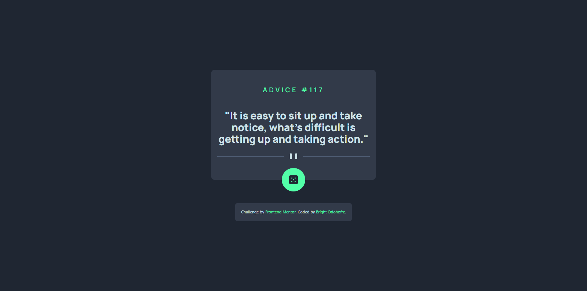
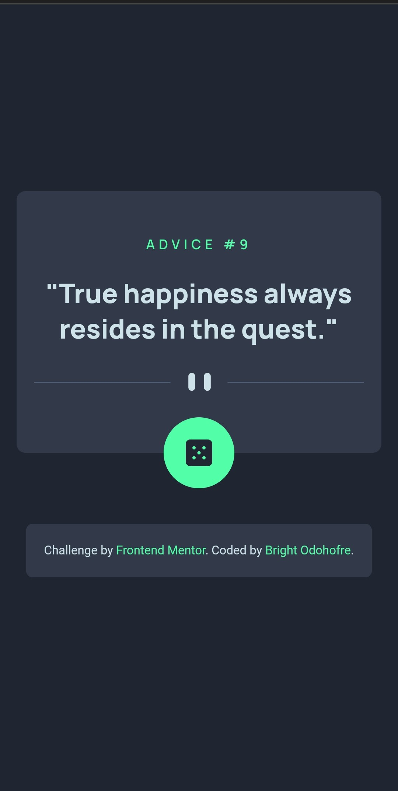

# Frontend Mentor - Advice generator app solution

This is a solution to the [Advice generator app challenge on Frontend Mentor](https://www.frontendmentor.io/challenges/advice-generator-app-QdUG-13db). Frontend Mentor challenges help you improve your coding skills by building realistic projects.

## Table of contents

- [Overview](#overview)
  - [The challenge](#the-challenge)
  - [Screenshot](#screenshot)
  - [Links](#links)
- [My process](#my-process)
  - [Built with](#built-with)
  - [What I learned](#what-i-learned)
- [Author](#author)

## Overview

### The challenge

Users should be able to:

- View the optimal layout for the app depending on their device's screen size
- See hover states for all interactive elements on the page
- Generate a new piece of advice by clicking the dice icon

### Screenshot




### Links

- Solution URL: [Github repo](https://github.com/Odohofre/advice-generator-app)
- Live Site URL: [Live Sit](https://advice-generator-app-eight-neon.vercel.app/)

## My process

### Built with

- Semantic HTML5 markup
- Flexbox
- Mobile-first workflow
- [Tailwind CSS](https://www.tailwindcss.com/) - CSS framework

### What I learned

- I learnt how to read APIs using `async/await` and the `fetch API`

```js
async function generateAdvice() {
  const response = await fetch(API_URL);
  
  if (!response.ok) {
    const message = `An error has occured: ${response.status}`
    throw new Error(message)
  }
  
  const data = await response.json();

  showAdvice(data);

}
```

- I learnt how to add the API's content directly to the dom

```js
function showAdvice(data) {
  const { id, advice } = data.slip;

  adviceId.innerText = `ADVICE #${id}`;
  adviceEl.innerText = `"${advice}"`;
}

```

## Author

- Website - [Bright Odohofre](https://odohofre.github.io)
- Frontend Mentor - [@Odohofre](https://www.frontendmentor.io/profile/Odohofre)
- Twitter - [@B_Odohofre](https://www.twitter.com/B_Odohofre)
